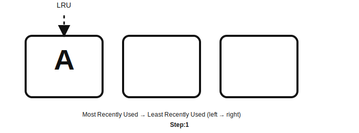
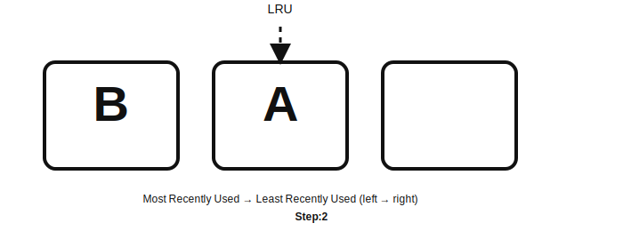
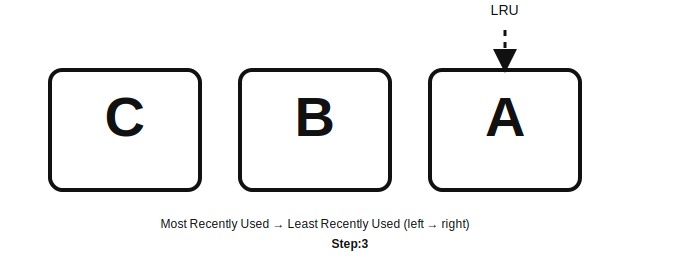
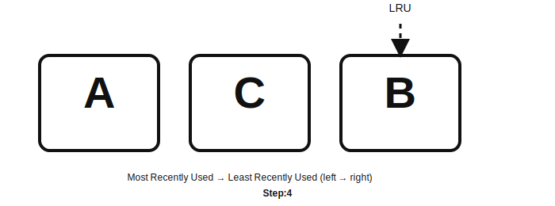
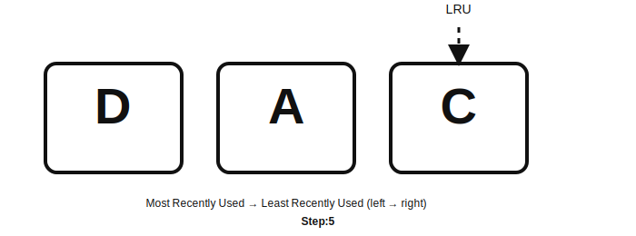
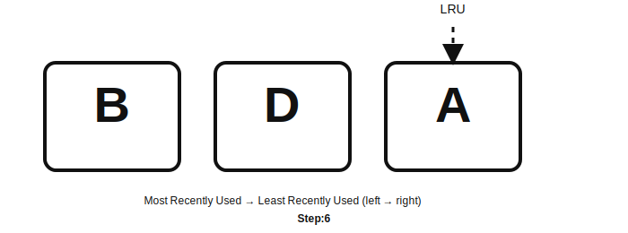
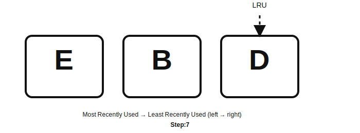

# LRU  Assignment 

An LRU Cache is a data structure that stores a limited number of items and automatically evicts the least recently used item when it reaches its capacity. It is designed to provide fast access and efficient eviction based on usage patterns.

The key idea behind LRU is simple,  If an item has not been used for the longest time, it is the best candidate to remove when space is needed.

LRU caches are widely used in:

- Operating systems (e.g., paging systems)
- Web browsers (storing recently visited pages)
- Databases (buffer pools)
- High-performance applications that require fast lookups

## Detailed Example

Assume a cache of size 3, assume the following access pattern: A, B, C, A, D, B, E. 

### Accessing  A 

At the beginning, the cache is empty, so page **A** is inserted into the MRU position. Since A is the only page present, it is also the least recently used page.

---

### Accessing B

The next referenced page is **B**, which is not in the cache. Page B is placed into the MRU position, pushing page **A** to the right. After this update, A becomes the least recently used page.

---

###  Accessing  C

Page **C** is referenced next and is not in the cache. It is inserted at the MRU position, and pages **B** and **A** shift right. Page **A** remains the least recently used page.

---

###  Accessing A

The page **A** is referenced again, even though it currently sits in the LRU position. According to the LRU policy, A must be promoted to the MRU position. Pages **C** and **B** shift right, and **B** becomes the least recently used page.

---

### Acessing  D

Page **D** is not in the cache and the cache is full. The LRU page, **B**, is evicted. Page D is inserted into the MRU slot, and the remaining pages shift to maintain recency order. Page **C** becomes the new LRU page.

---

### Accessing B

Page **B** is referenced again, but it was evicted earlier and is not in the cache. This results in a page fault. The current LRU page, **C**, is removed to make space. Page B is inserted into the MRU position, shifting pages **D** and **A** to the right. Page **A** becomes the new LRU. 

---

###  Acessing E

Finally, page **E** is referenced and is not currently in the cache. The LRU page, **A**, is evicted. Page E is inserted into the MRU position, and pages **B** and **D** shift accordingly. Page **D** becomes the new least recently used page.

## Problem Description
 Implement the `LRUCache` class:

* `LRUCache(int capacity)` — Initialize the LRU cache with a **positive size** capacity.
* `int get(int key)` — Return the value of the key if the key exists; otherwise, return `-1`.
* `void put(int key, int value)` — Update the value of the key if the key exists. Otherwise, add the key-value pair to the cache. If the number of keys exceeds the capacity because of this operation, **evict** the least recently used key.

**Constraints:**
The `get` and `put` functions must each run in **O(1)** average time complexity.

**Link:**
[LeetCode — LRU Cache](https://leetcode.com/problems/lru-cache/description/)

Here is a clean, structured, professionally formatted version of your content:

## Solution Overview

###  GET and PUT Operations

* **`GET(key)`**: Must return the corresponding value if it exists. Crucially, it must also **update the item's usage status** so it becomes the **most recently used (MRU)** item.
* **`PUT(key, value)`**: Must insert or update a key/value pair. If the cache is **full**, it must first **remove the least recently used (LRU) item** to make space before inserting the new entry.

Both operations must maintain **$O(1)$ time complexity**, requiring a design that supports both **fast key lookup** and **quick updates to the usage order**.

To achieve that an LRU cache needs to efficiently track two separate pieces of information simultaneously:

1.  **Quick access to items by key** (for fast lookups).
2.  **A strict record of the usage order** (for determining the MRU and LRU items).

This naturally leads to combining a **Hash Map** (or dictionary) with a **Doubly Linked List**.

* **The Hash Map**: Provides **instant, $O(1)$ lookup** by mapping each **key** to its corresponding **node** in the linked list. This is what enables the `GET` operation to quickly find an item.
* **The Doubly Linked List**: Preserves the **usage order** of the items.
    * The **Head** of the list always represents the **Most Recently Used (MRU)** item.
    * The **Tail** of the list always represents the **Least Recently Used (LRU)** item.

This combination works efficiently because a **doubly linked list** allows any node to be **removed** from its current position and **moved** to the head in **$O(1)$ time**, without needing to traverse the list.

### GET Psuedo Code

1.  The cache first checks the **Hash Map** for the `key`.
2.  If the key **does not exist**, it returns an indicator (e.g., –1).
3.  If the key **does exist**, the hash map provides a direct reference to the list **node**.
4.  The node is **removed** from its current position and **moved to the Head** of the doubly linked list.
5.  The node's value is then returned.

This ensures that **every access** automatically updates the item’s recency status to MRU.

---

### PUT Psuedo Code

1.  The cache checks the **Hash Map** to see if the key already exists.
2.  **Case 1: Key Exists (Update)**: The existing node's value is updated, and the node is **moved to the Head** (marking it as MRU).
3.  **Case 2: New Key (Insertion)**:
    a.  The cache checks if the capacity is **full**.
    b.  If full, the node at the **Tail** (the LRU item) is **removed** from both the list and the hash map (this is the eviction step).
    c.  A **new node** is created, inserted at the **Head** of the list, and the **Hash Map** is updated to point to this new node.

---
## Submission

Submit your code with the accepted screenshot from leetcode.

[LeetCode — LRU Cache](https://leetcode.com/problems/lru-cache/description/)
